## OUR-GAN: One-shot Ultra-high-Resolution Generative Adversarial Networks - Demo

### Abstract
We propose OUR-GAN, the first one-shot ultra-high-resolution (UHR) image synthesis framework that generates non-repetitive images with 4K or higher resolution from a single training image. OUR-GAN generates a visually coherent image at low resolution and then gradually increases the resolution by super-resolution. Since OUR-GAN learns from a real UHR image, it can synthesize large-scale shapes with fine details while maintaining long-range coherence, which is difficult with conventional generative models that generate large images based on the patch distribution learned from relatively small images. OUR-GAN applies seamless subregion-wise super-resolution that synthesizes 4k or higher UHR images with limited memory preventing discontinuity at the boundary. Additionally, OUR-GAN improves diversity and visual coherence by adding vertical positional embeddings to the feature maps. In experiments on the ST4K and RAISE datasets, OUR-GAN exhibited improved fidelity, visual coherency, and diversity compared with existing methods. The synthesized images are presented at https://anonymous-62348.github.io.
<br>
<br>


### Notice
Loading UHR images may take time because the files are large. \
Therefore, We've posted downsampled versions of the images on this page for faster image loading. \
**Click on the images to access the full-size raw images.** \
The images may look distorted depending on the viewer since the image resolution is very high. \
So, please download samples and evaluate the quality. \
Download all samples - [link](https://drive.google.com/drive/folders/1dolQ7Go4IJmPgkTbhSZ20GWk53INSKR5?usp=sharing)

<br>

### 1. 16K (16,384 x 10,912) image synthesized by OUR-GAN trained with a single 4K training image.
OUR-GAN can synthesize UHR image with higher resolution than that of the training image. \
The resolution of this image is 16K, whereas that of the training image is only 4K. \
OUR-GAN synthesize high-fidelity UHR images, preserving even fine details.
<br>


<table>
<thead>
  <tr>
    <th><a href="https://drive.google.com/file/d/1KnUvKsokhtQTjrsukftC9rcJ8BIDfuN6/view?usp=sharing" target="_blank"></a></th>
  </tr>
</thead>
<tbody>
 <tr>
    <td><div align=center><b>16K (16,384 x 10,912) Images synthesized by OUR-GAN</b></div></td>
 </tr>
</tbody>
</table>


<table>
<thead>
  <tr>
    <th><a href="https://drive.google.com/file/d/1s1GiUl2gQnySx9iCVr2HAKPJzovs-eAI/view?usp=sharing" target="_blank"></a></th>
  </tr>
</thead>
<tbody>
 <tr>
    <td><div align=center><b>4K (4,096 x 2,728) training image</b></div></td>
 </tr>
</tbody>
</table>


<table>
<thead>
  <tr>
    <th><a href="https://drive.google.com/file/d/1OjRdTokqMlMkP4QptHvC9c47rj2w9JXb/view?usp=sharing" target="_blank"></a></th>
    <th><a href="https://drive.google.com/file/d/1locTavVIL-gzAC5HRXuSIekqxnDeiO6z/view?usp=sharing" target="_blank"></a></th>

  </tr>
</thead>
<tbody>
 <tr>
    <td colspan="2"><div align=center><b>8K (8,192 x 5,456) images synthesized by OUR-GAN</b></div></td>
 </tr>
</tbody>
</table>

<br>


### 2. Improving visual coherence
For one-shot image synthesis, achieving visual coherence while maintaining diversity is challenging. \
HP-VAE-GAN[1] synthesizes diverse images but fails to catch global coherence, as shown below. \
OUR-GAN, applied vertical coordinate convolution to HP-VAE-GAN, significantly improves the global coherence of patterns still generating diverse patterns.\
Download samples - [link](https://drive.google.com/drive/folders/1fKEny60i508IzPfD_ad6LOY6Qbc_nOtF?usp=sharing)
<br>

<table>
<thead>
  <tr>
    <th><a href="https://drive.google.com/file/d/10GEWIesF0H_Dt3XDO7bmtErdAGq-nQCF/view?usp=sharing" target="_blank">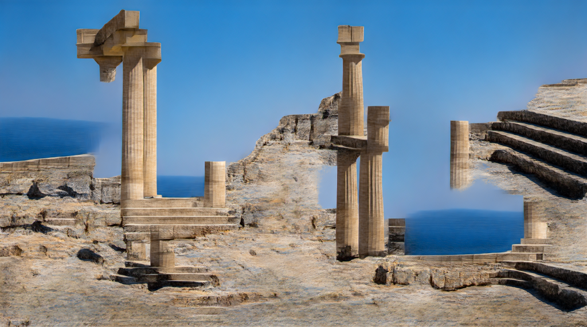</a></th>
    <th><a href="https://drive.google.com/file/d/17xryGUAxk09uKfucEaX6OyeNYIKMZw8C/view?usp=sharing" target="_blank">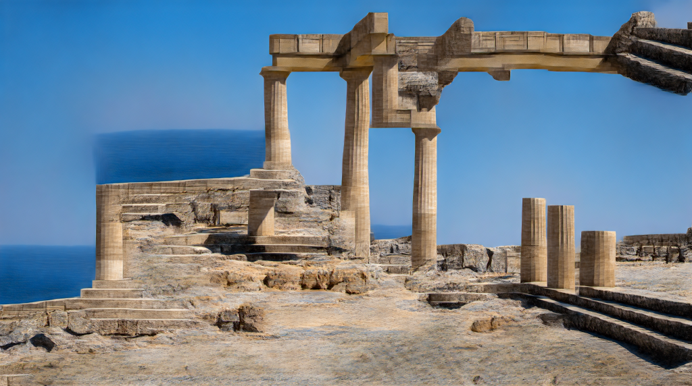</a></th>
    <th><a href="https://drive.google.com/file/d/1by3AH8Nw3yxwb5rj0hAqiolEl7KoZlEY/view?usp=sharing" target="_blank">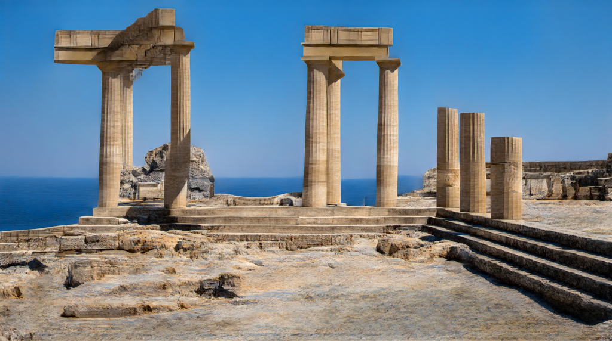</a></th>
    <th><a href="https://drive.google.com/file/d/1OkcvaJhA-IwbnZwLk5Hp0I2kurb4ggcj/view?usp=sharing" target="_blank">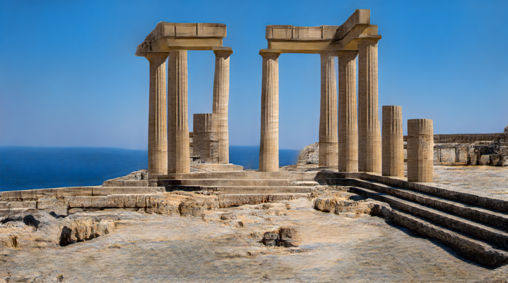</a></th>
   

 </tr>
</thead>
<tbody>
 <tr>
    <th><a href="https://drive.google.com/file/d/10UBBH9TJ-ZGcypkFggHXpITVOvBoPzE3/view?usp=sharing" target="_blank">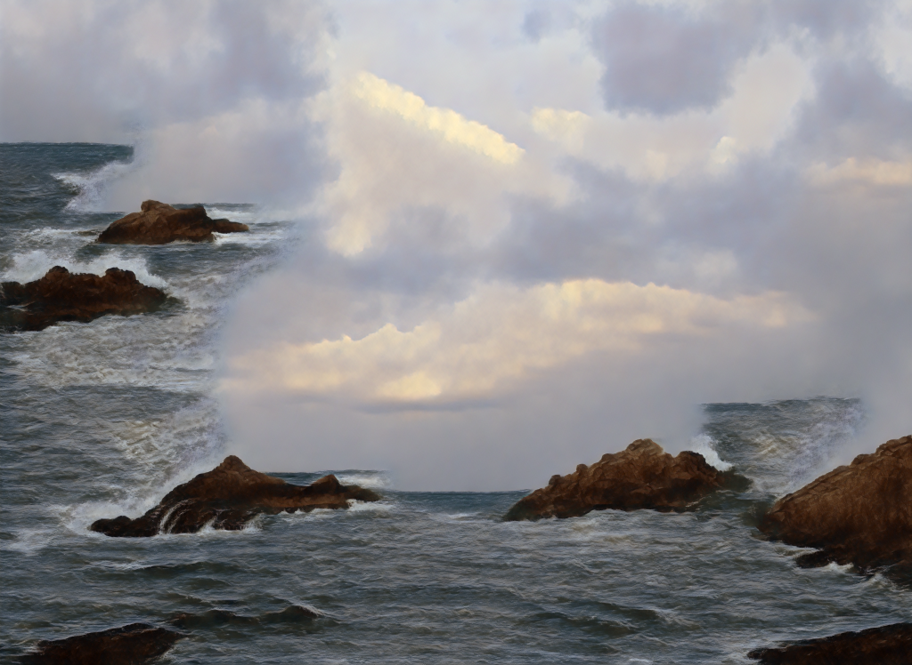</a></th>
    <th><a href="https://drive.google.com/file/d/1Reb5MZF3Vm9seVGV_8wW0e3jkH2TS8P3/view?usp=sharing" target="_blank">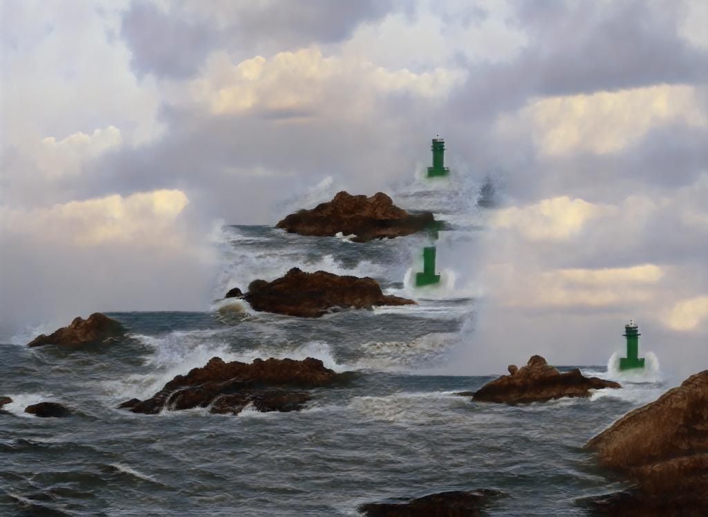</a></th>
    <th><a href="https://drive.google.com/file/d/1ThvvpuyirB-ATfjSDerRzxheR3pL7Tr0/view?usp=sharing" target="_blank">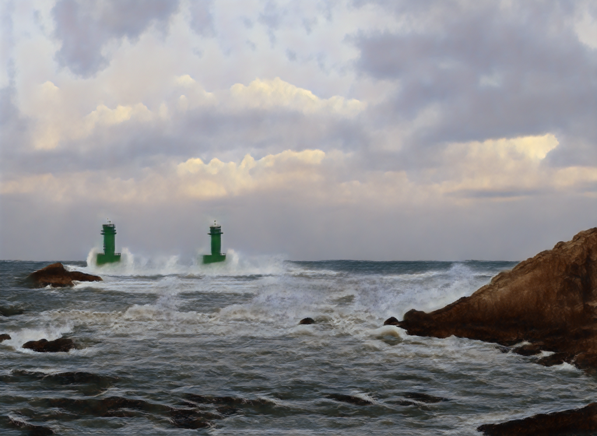</a></th>
    <th><a href="https://drive.google.com/file/d/1uUzcJcrrRWacpvXV03rRmqZjGrZkE5tK/view?usp=sharing" target="_blank">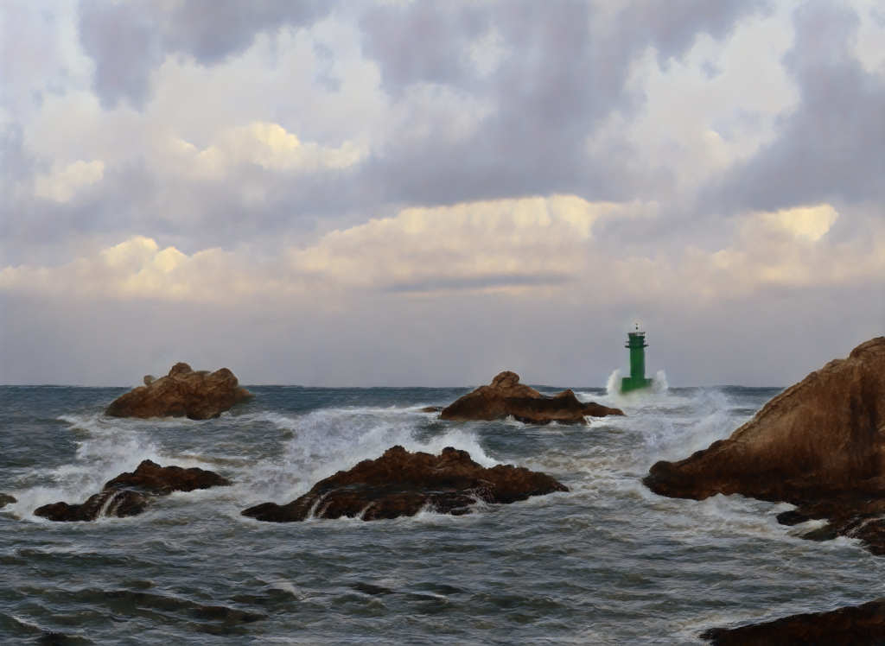</a></th>
 </tr>
 <tr>
    <td colspan="2"><div align=center><b>HP-VAE-GAN</b></div></td>
    <td colspan="2"><div align=center><b>OUR-GAN (proposed) <br> (HP-VAE-GAN + Vertical coordinate convolution) </b></div></td>
 </tr>
</tbody>
</table>


<br>

### 3. Large-scale shape generation 

For UHR image synthesis, models that learns from small patch images like InfinityGAN[2] are hard to synthesize large-scale shapes.\
But, OUR-GAN can synthesize globally coherent large-scale objects such as buildings.\
You can download full-size InfinityGAN samples in the [InfinityGAN project page](https://hubert0527.github.io/infinityGAN/).\
Download samples - [link](https://drive.google.com/drive/folders/1pgyolhbutsw3fpeeG73O5ynRUZIGIgia?usp=sharing)\
<br>


<table>
<thead>
  <tr>
    <th><a href="https://drive.google.com/file/d/1gCqqCaIP_yFMkt5zrreh8smXB-NLlTlQ/view?usp=sharing" target="_blank"></a></th>
    <th><a href="https://drive.google.com/file/d/1rYitkLTsLlINzruv1m_I9565SxOPO6tP/view?usp=sharing" target="_blank"></th>
 </tr>
</thead>
<tbody>
  <tr>
    <td colspan="2"><div align=center><b>OUR-GAN (proposed)</b></div></td>
  </tr>
</tbody>
</table>

<br>


<table>
<thead>
  <tr>
    <th>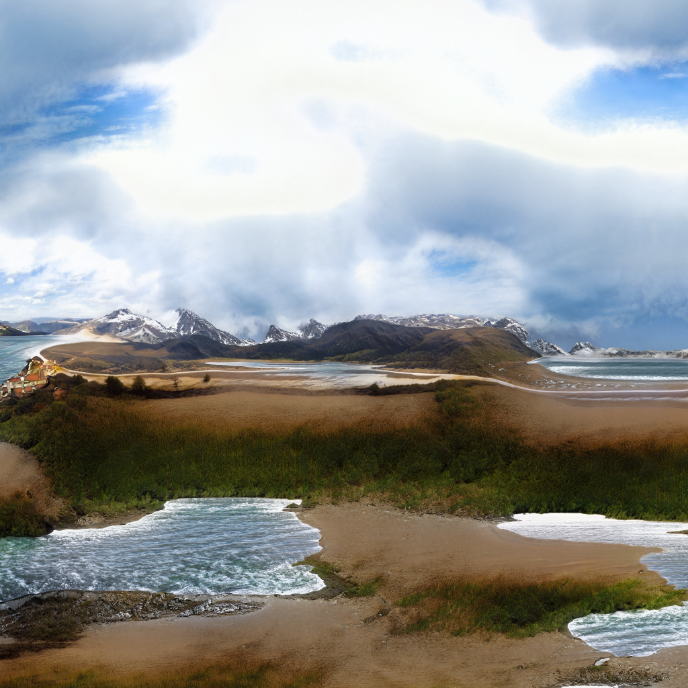</th>
    <th>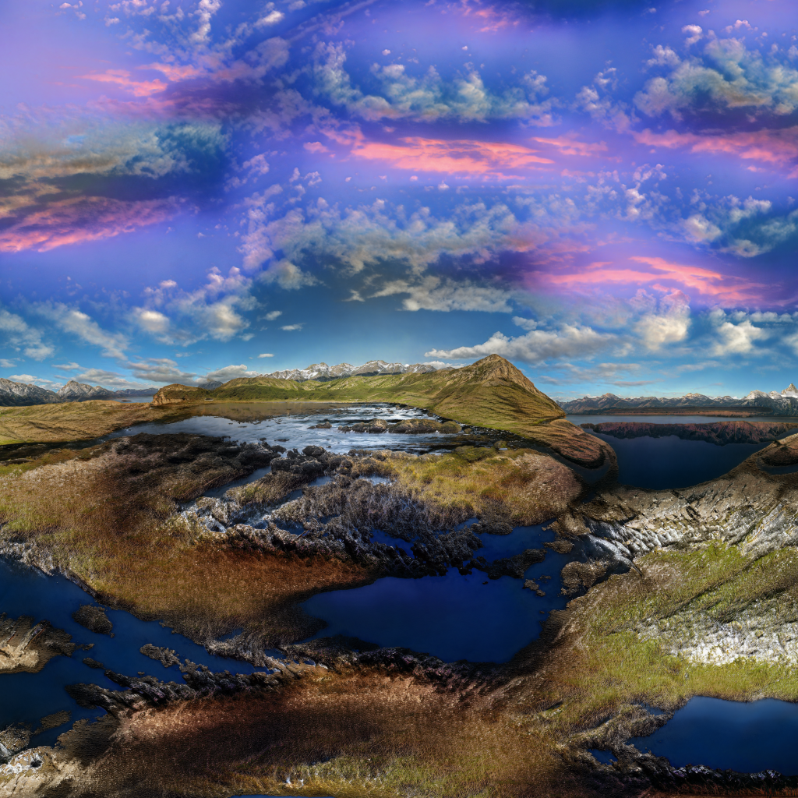</th>
    <th>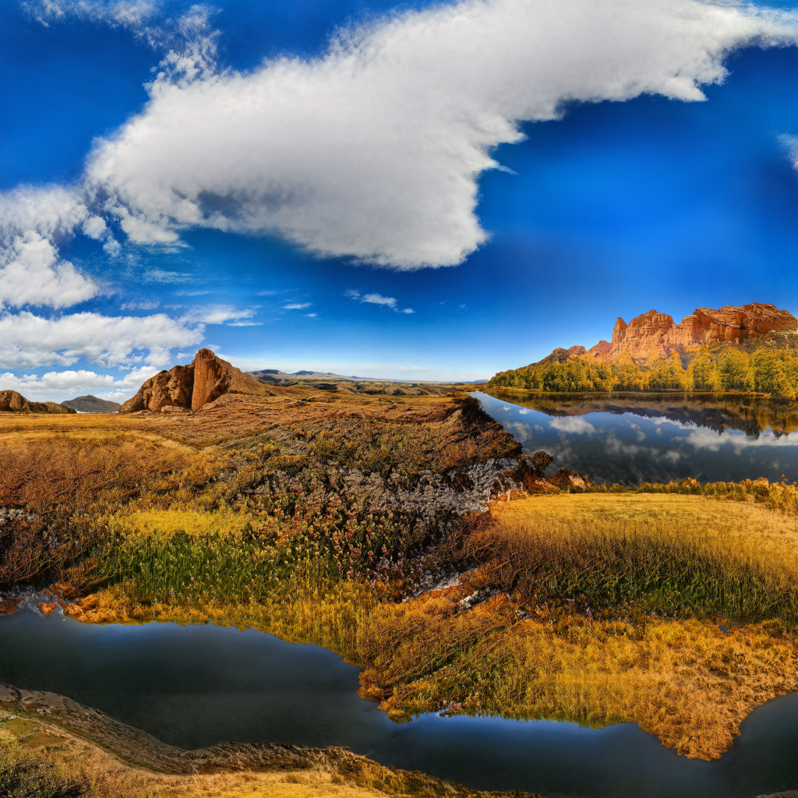</th>
 </tr>
</thead>
<tbody>
  <tr>
    <td colspan="3"><div align=center><b>InfinityGAN</b></div></td>
  </tr>
</tbody>
</table>


### References

<b>[1] Shir Gur, Sagie Benaim, and Lior Wolf. Hierarchical patch vae-gan: Generating diverse videos from a single
sample. In H. Larochelle, M. Ranzato, R. Hadsell, M. F. Balcan, and H. Lin, editors, Advances in Neural
Information Processing Systems, volume 33, pages 16761–16772. Curran Associates, Inc., 2020.
</b>

<b>[2] Chieh Hubert Lin, Yen-Chi Cheng, Hsin-Ying Lee, Sergey Tulyakov, and Ming-Hsuan Yang. InfinityGAN:
Towards infinite-pixel image synthesis. In International Conference on Learning Representations, 2022.
</b>


<!-- <br>

### 4K scenery images synthesized by OUR-GAN
OUR-GAN successfully synthesized high-quality non-repetitive images with visually coherent shapes with fine details.

| [](/assets/images/4K/11000_0.png) | [](/assets/images/4K/11000_17.png) |
|---|---|
| [](/assets/images/4K/11015_17.png) | [](/assets/images/4K/11015_28.png) |
| [](/assets/images/4K/11021_0.png) | [](/assets/images/4K/11021_18.png) |
| [](/assets/images/4K/11013_44.png) | [](/assets/images/4K/11013_46.png) |

<br>

### 4K texture images synthesized by OUR-GAN
OUR-GAN successfully synthesized high-quality texture images with diverse patterns.

| [](/assets/images/4K/21000_52.png) | [](/assets/images/4K/21000_66.png) |
|---|---|
| [](/assets/images/4K/21022_52.png) | [](/assets/images/4K/21022_83.png) | -->

<!-- You can use the [editor on GitHub](https://github.com/anonymous-62348/anonymous-62348.github.io/edit/main/README.md) to maintain and preview the content for your website in Markdown files.

Whenever you commit to this repository, GitHub Pages will run [Jekyll](https://jekyllrb.com/) to rebuild the pages in your site, from the content in your Markdown files.

### Markdown

Markdown is a lightweight and easy-to-use syntax for styling your writing. It includes conventions for

```markdown
Syntax highlighted code block

# Header 1
## Header 2
### Header 3

- Bulleted
- List

1. Numbered
2. List

**Bold** and _Italic_ and `Code` text

[Link](url) and 
```

For more details see [Basic writing and formatting syntax](https://docs.github.com/en/github/writing-on-github/getting-started-with-writing-and-formatting-on-github/basic-writing-and-formatting-syntax).

### Jekyll Themes

Your Pages site will use the layout and styles from the Jekyll theme you have selected in your [repository settings](https://github.com/anonymous-62348/anonymous-62348.github.io/settings/pages). The name of this theme is saved in the Jekyll `_config.yml` configuration file.

### Support or Contact

Having trouble with Pages? Check out our [documentation](https://docs.github.com/categories/github-pages-basics/) or [contact support](https://support.github.com/contact) and we’ll help you sort it out.
 -->
